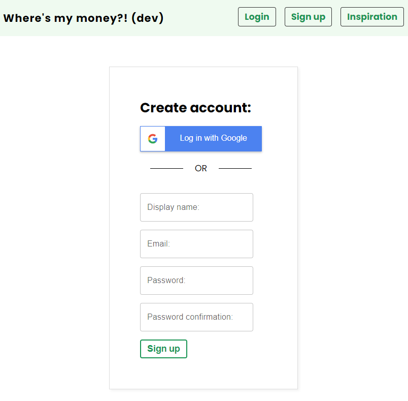
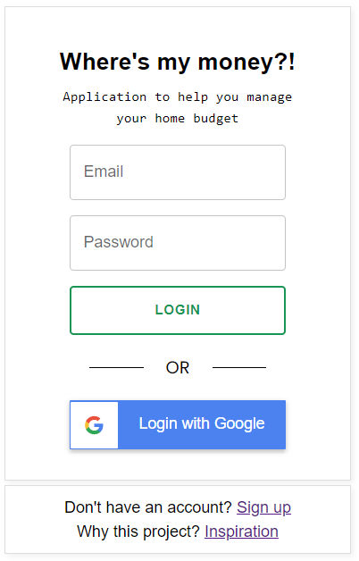
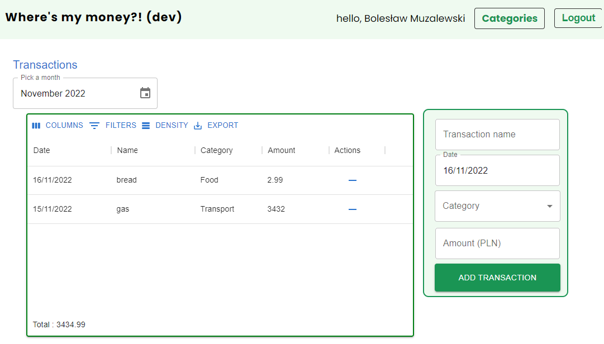
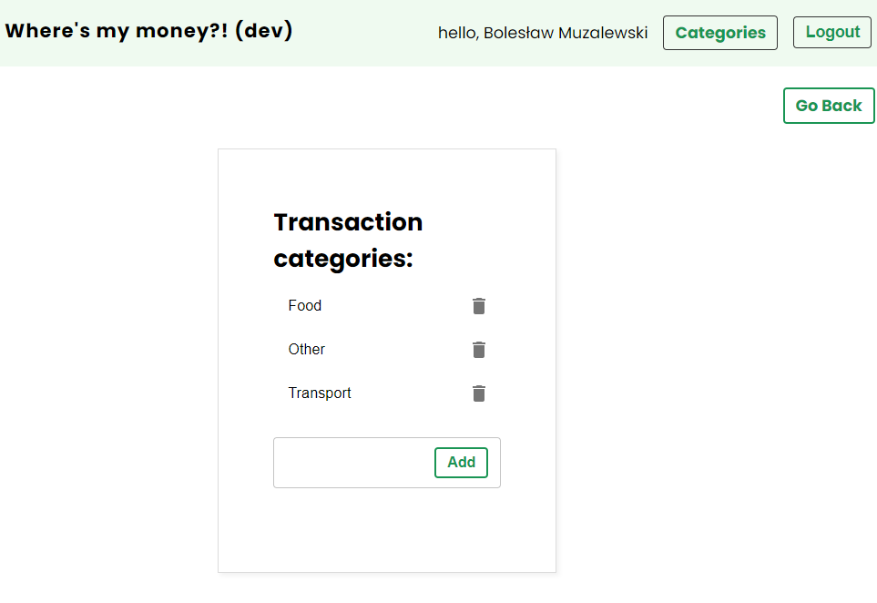

# Where's my money?!

The project was created to better manage the household budget.

Application uses:
* Functions components
* Custom React hooks
* React Router
* Firebase
* Material-UI
* Formik

## Table of contents
* [General info](#general-info)
* [Deployment](#deployment)
* [Screenshots](#screenshots)
* [Technologies](#technologies)
* [Setup](#setup)
* [Status](#status)
* [Inspiration](#inspiration)

## General info
Project allows to:
* create a profile account - sign up  & log in 
* add transactions (name, date, category, amount)
* add categories of transactions
* see list of all transaction for a given month
* filter transactions by months

## Deployment
| Environment | link |
|---|---|
| development | https://whereismymoneysir-dev.web.app |
| production | https://whereismymoneysir.web.app |

## Screenshots
You can sign up to the app by register or Login with your Google account:


You can log in to the app:


When you are logged in you can see all of your transactions and add a new ones:



You can add/remove categories:

## Technologies
Main:
* React
* html, css

Libraries:
* material-ui
* forimik
* dayjs
* firebase
* and many others

## Setup
Copy repository on your machine. To download all needed dependencies (see package.json to know what they are) type in command line in the repo's location:
```bash
npm install
```
To run application on your local machine type: 
```bash
npm run start
```
You will need to change .env.sample file. You need to go to firebase website and create a new project there.

## Status
I work on this project in my spare time. It is possible that the screenshots here are not up to date - it is constantly changing. I really enjoy adding new features here and I treat this app as my code-sandbox. \
Hopefully, me and my friends in the near future will be able to actually use this app to keep our private budgets in it.

## Inspiration
Credits for:

[Shaun Pelling](https://github.com/iamshaunjp) - for an idea for this project and his excelent firebase tutorial. Thank you.
[Ben Awad](https://github.com/benawad) - for his intuitive Formik FormFields.Thank you.

And, of course as always - StackOverflow... :)
